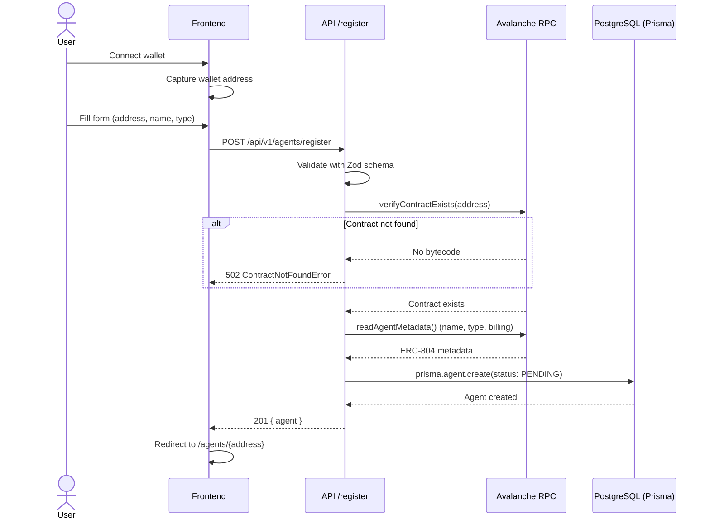
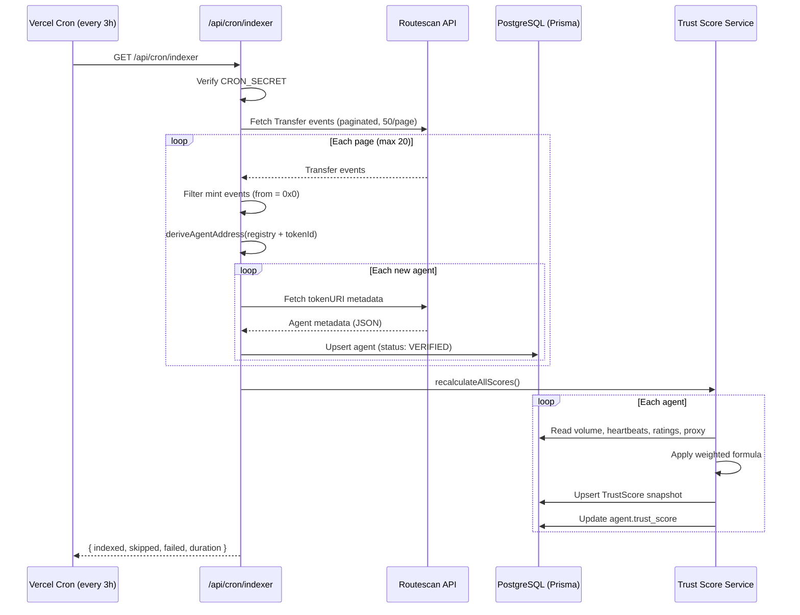
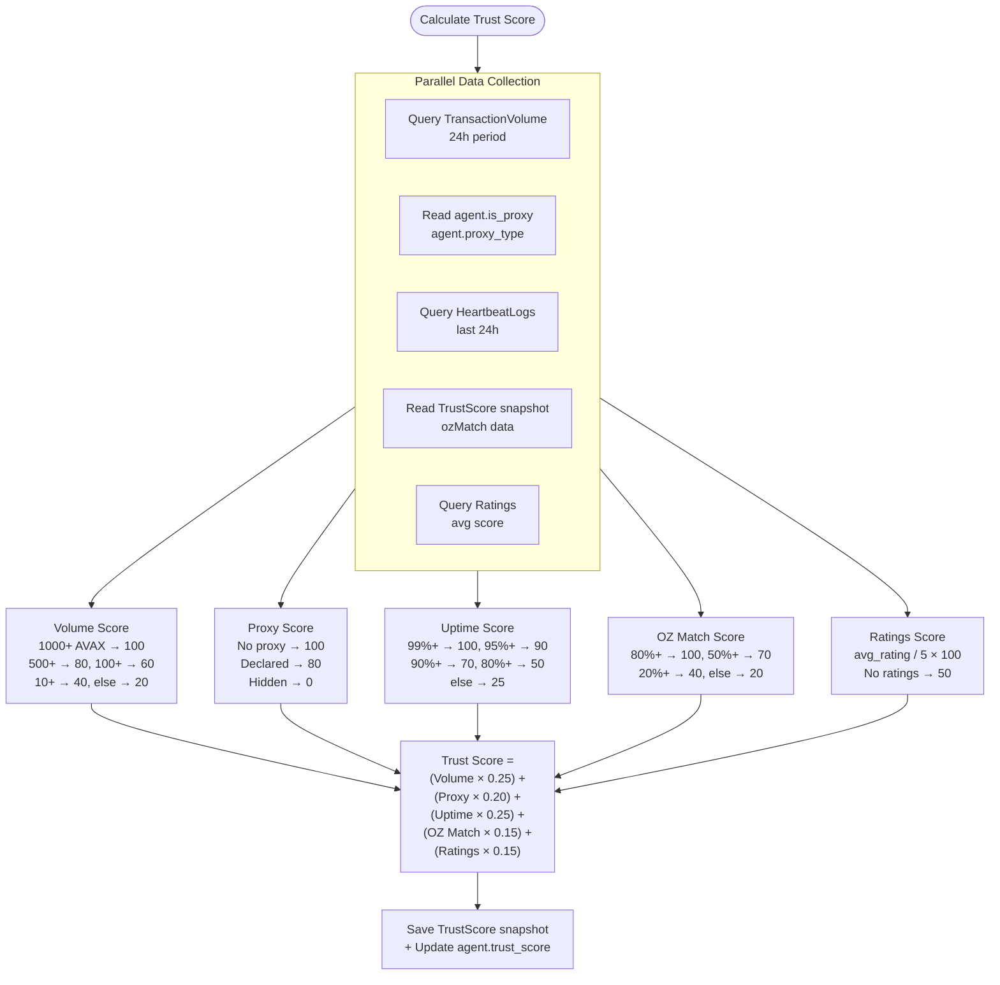
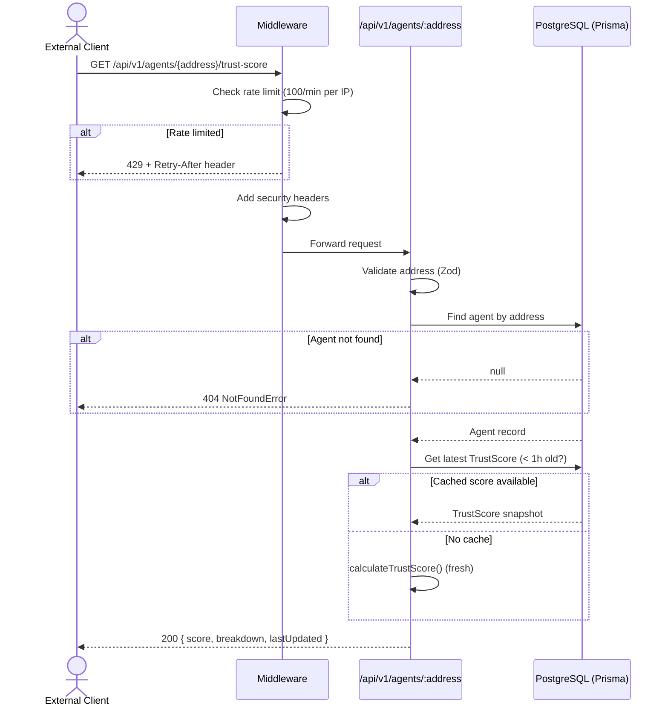
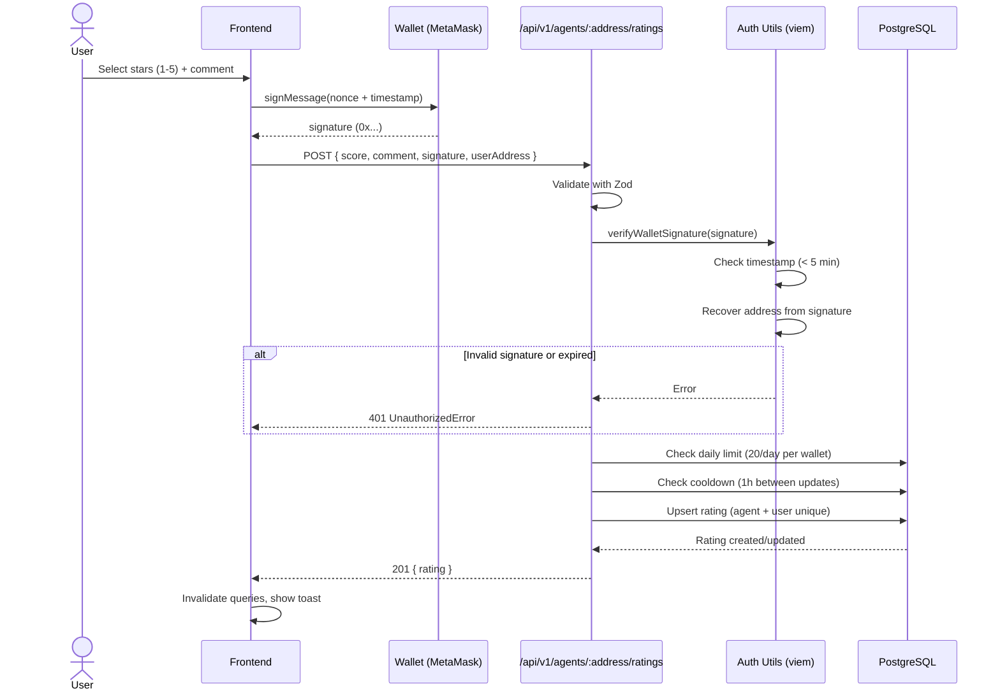

# Data Flows

## Flow 1: Agent Registration

## Flow 2: Indexer Discovery (Cron)

## Flow 3: Trust Score Calculation

## Flow 4: Agent Query (API)

## Flow 5: Rating Submission

## Trust Score Ranges

| Range | Label | Color | Description |
|-------|-------|-------|-------------|
| 80-100 | Excellent | Green | Highly trusted, all signals positive |
| 60-79 | Good | Blue | Generally trusted, minor concerns |
| 40-59 | Medium | Yellow | Use with caution, some flags |
| 0-39 | Low | Red | Not recommended, significant issues |
