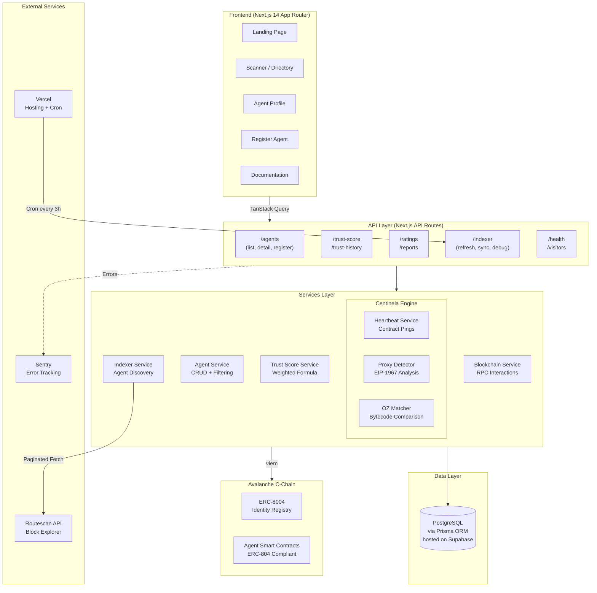
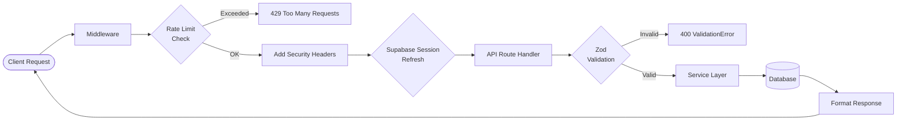

# System Architecture

## High-Level Diagram

## Request Lifecycle

## System Components

### Frontend (Next.js App)

**Responsibilities**:
- Render UI (landing, scanner, agent profile, docs)
- Connect wallet (wagmi + viem)
- Consume REST API via TanStack Query
- Client-side validation (Zod)

**Does NOT**:
- Direct blockchain queries (delegates to API)
- Direct database queries (only via API)
- Business logic (trust score, proxy detection)

### Backend (Next.js API Routes)

**Responsibilities**:
- Expose REST endpoints (20 routes)
- Validate requests (Zod schemas)
- Authenticate wallets (verify signatures with viem)
- Database queries via Prisma ORM
- Avalanche RPC queries (via viem with fallback transport)
- Rate limiting (100/min default, 5/hour registration)
- Structured logging (Pino)

### Indexer (Background Job)

**Responsibilities**:
- Run every 3 hours via Vercel Cron
- Scan ERC-8004 Identity Registry for new agents via Routescan API
- Resolve agent metadata from tokenURI (data URIs, HTTP, base64)
- Generate deterministic pseudo-addresses from registry + tokenId
- Recalculate trust scores for all agents after indexing

### Centinela (Verification Engine)

**Responsibilities**:
- **Heartbeat**: Ping agent contracts to verify uptime (checks bytecode + name() call)
- **Proxy Detection**: Analyze EIP-1967 storage slots + delegatecall bytecode patterns
- **OZ Matcher**: Compare bytecode against OpenZeppelin function selectors and event topics

### Database (Supabase PostgreSQL + Prisma)

**Responsibilities**:
- Persist agents, trust scores, ratings, reports, heartbeat logs
- Transaction volume tracking by period
- User and watchlist management
- API key storage and validation
- Daily platform metrics
- Visitor tracking
