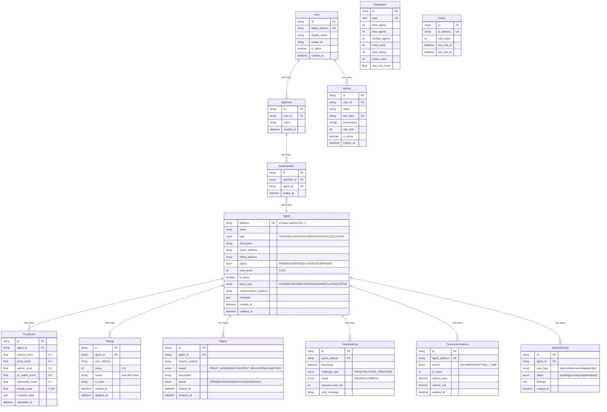

# Database Schema (Supabase + Prisma)

## Entity Relationship Diagram



## Key Indexes

| Table | Index | Purpose |
|-------|-------|---------|
| `agents` | `type` | Filter by agent type |
| `agents` | `status` | Filter by status |
| `agents` | `trust_score DESC` | Sort by trust score |
| `trust_scores` | `agent_id, calculated_at DESC` | Latest score per agent |
| `ratings` | `agent_id, user_address` (unique) | One rating per user per agent |
| `reports` | `agent_id, reporter_address` (unique) | One report per user per agent |
| `heartbeat_logs` | `agent_address, timestamp DESC` | Recent heartbeats per agent |
| `transaction_volumes` | `agent_address, period` (unique) | One record per agent per period |

## Prisma Schema

```prisma
generator client {
  provider = "prisma-client-js"
}

datasource db {
  provider  = "postgresql"
  url       = env("DATABASE_URL")
  directUrl = env("DIRECT_URL")
}
```

> Full schema: [`prisma/schema.prisma`](../../prisma/schema.prisma) (418 lines)

## Migrations

```bash
# Create new migration
npx prisma migrate dev --name add_feature

# Apply migrations in production
npx prisma migrate deploy

# Reset DB (development only)
npx prisma migrate reset

# Generate Prisma Client
npx prisma generate

# Open visual DB browser
npx prisma studio
```

## Common Queries

```typescript
// services/agent-service.ts
import { prisma } from '@/lib/database/prisma';

// List agents with filters
const agents = await prisma.agent.findMany({
  where: {
    type,
    status,
    trust_score: { gte: minTrustScore, lte: maxTrustScore },
  },
  include: {
    trustScores: { orderBy: { calculatedAt: 'desc' }, take: 1 },
    ratings: true,
  },
  orderBy: { trust_score: 'desc' },
  skip: (page - 1) * limit,
  take: limit,
});

// Upsert rating (one per user per agent)
await prisma.rating.upsert({
  where: { agentId_userAddress: { agentId, userAddress } },
  update: { rating: score, review: comment },
  create: { agentId, userAddress, rating: score, review: comment },
});
```
