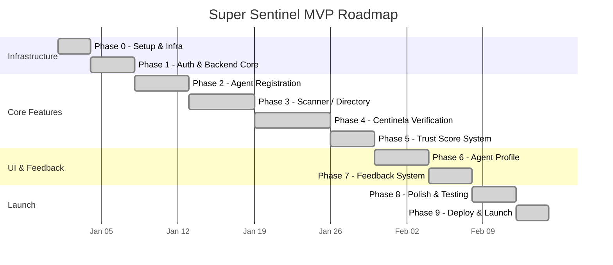
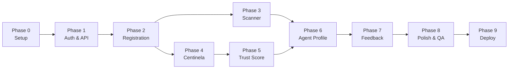

# Development Roadmap

## Timeline

## Phase Dependencies

## Phase Details

### Phase 0: Setup & Infrastructure (2-3 days)

- Initialize Next.js 14 project with TypeScript
- Configure TailwindCSS and shadcn/ui
- Setup Supabase project + Prisma ORM
- Configure ESLint, Prettier, Husky
- Setup Pino logging

### Phase 1: Auth & Backend Core (3-4 days)

- Configure wagmi and viem
- Create WalletConnectButton component
- Build Header with wallet connection
- Create health check API route
- Build API helper utilities + custom error classes
- Setup rate limiting middleware

### Phase 2: Agent Registration (4-5 days)

- Define Prisma Agent model
- Create Zod validation schemas
- Setup viem client and ERC-804 ABI
- Build blockchain service + agent service (CRUD)
- Implement POST /agents/register API
- Build registration page frontend

### Phase 3: Scanner / Directory (5-6 days)

- Implement GET /agents API with filtering
- Create useAgents hook
- Build AgentTable (TanStack Table) + AgentCard
- Create Filters component + SearchBar with autocomplete
- Build Scanner page layout with KPI cards

### Phase 4: Centinela Verification (5-7 days)

- Build proxy detection service (EIP-1967 analysis)
- Create heartbeat service (contract pings)
- Build OpenZeppelin bytecode matcher
- Create indexer service (Routescan API + RPC)
- Configure Vercel Cron (every 3 hours)

### Phase 5: Trust Score (3-4 days)

- Build trust score service with weighted formula
- Create trust score snapshot system
- Implement trust-score and trust-history API endpoints
- Add TrustScoreBadge + breakdown components

### Phase 6: Agent Profile (4-5 days)

- Build agent detail page with tabs (Overview, Activity, Community, Metadata)
- Create trust score breakdown visualization
- Build heartbeat timeline display
- Implement share and embed functionality

### Phase 7: Feedback System (3-4 days)

- Implement ratings API (with wallet signature verification)
- Implement reports API (with auto-flagging at 3+ reports)
- Build RatingForm component (stars + comment)
- Create ReportModal component (reason + description)

### Phase 8: Polish & Testing (3-4 days)

- Vitest unit + integration tests (80% coverage target)
- Performance optimization
- Mobile responsiveness QA
- Accessibility review
- Security review

### Phase 9: Deploy & Launch (2-3 days)

- Configure Vercel production
- Setup Supabase production database
- Configure Sentry error tracking
- Setup monitoring and alerts
- Deploy!

**Total MVP**: ~35-45 days (~7-9 weeks)
