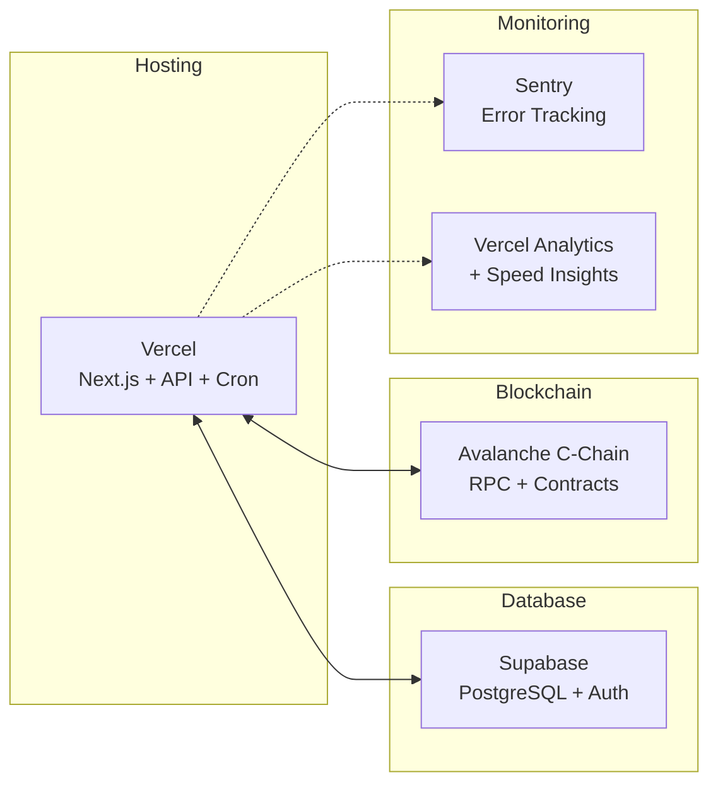
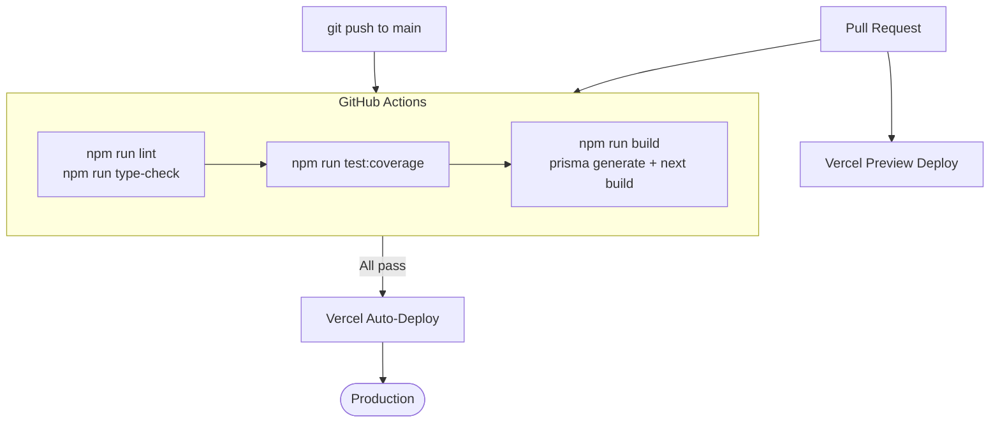

# Deployment & DevOps

## Infrastructure



| Service | Purpose | Environment |
|---------|---------|-------------|
| **Vercel** | Frontend + API hosting + Cron Jobs | Production |
| **Supabase** | PostgreSQL database via Prisma ORM | Production |
| **Sentry** | Error tracking (client + server + edge) | Monitoring |
| **Vercel Analytics** | Page views + Speed Insights | Monitoring |

## CI/CD Pipeline



### GitHub Actions Workflow

```yaml
# .github/workflows/ci.yml
name: CI

on:
  push:
    branches: [main]
  pull_request:
    branches: [main]

jobs:
  lint:
    runs-on: ubuntu-latest
    steps:
      - uses: actions/checkout@v4
      - uses: actions/setup-node@v4
        with:
          node-version: '20'
          cache: 'npm'
      - run: npm ci
      - run: npm run lint
      - run: npm run type-check

  test:
    runs-on: ubuntu-latest
    needs: lint
    steps:
      - uses: actions/checkout@v4
      - uses: actions/setup-node@v4
        with:
          node-version: '20'
          cache: 'npm'
      - run: npm ci
      - run: npm run test:coverage

  build:
    runs-on: ubuntu-latest
    needs: [lint, test]
    steps:
      - uses: actions/checkout@v4
      - uses: actions/setup-node@v4
        with:
          node-version: '20'
          cache: 'npm'
      - run: npm ci
      - run: npm run build
```

## Environment Variables

### Public (safe for browser)

```bash
NEXT_PUBLIC_SUPABASE_URL=https://xyz.supabase.co
NEXT_PUBLIC_SUPABASE_ANON_KEY=eyJ...
NEXT_PUBLIC_AVALANCHE_RPC_URL=https://api.avax.network/ext/bc/C/rpc
NEXT_PUBLIC_WALLETCONNECT_PROJECT_ID=abc123
NEXT_PUBLIC_CHAIN_ENV=mainnet
NEXT_PUBLIC_SITE_URL=https://your-domain.com
```

### Server-only (set in Vercel dashboard)

```bash
SUPABASE_SERVICE_ROLE_KEY=eyJ...
DATABASE_URL=postgresql://...?pgbouncer=true
DIRECT_URL=postgresql://...
AVALANCHE_RPC_FALLBACK_URL=https://rpc.ankr.com/avalanche
CRON_SECRET=<openssl rand -hex 32>
INDEXER_API_SECRET=<openssl rand -hex 32>
SENTRY_DSN=https://...@sentry.io/...
NEXT_PUBLIC_SENTRY_DSN=https://...@sentry.io/...
SENTRY_ORG=your-org
SENTRY_PROJECT=super-sentinel
SENTRY_AUTH_TOKEN=sntrys_...
```

## Vercel Configuration

```json
// vercel.json
{
  "crons": [
    {
      "path": "/api/cron/indexer",
      "schedule": "0 */3 * * *"
    }
  ]
}
```

## Database Migrations

```bash
# Development
npx prisma migrate dev --name add_feature

# Production (run in CI or manually)
npx prisma migrate deploy

# Generate client after schema changes
npx prisma generate
```

## Health Checks

- `GET /api/v1/health` — API + DB + RPC health
- Vercel deployment status dashboard
- Sentry error dashboard and alerts

## Rollback Procedure

1. **App rollback**: Vercel Dashboard → Deployments → Promote previous deployment
2. **DB rollback**: `npx prisma migrate resolve --rolled-back <migration-name>`
3. **Config rollback**: Fix environment variables in Vercel → Redeploy

## Security Checklist

- [ ] Environment variables set correctly (no secrets in `NEXT_PUBLIC_*`)
- [ ] Rate limiting enabled (100/min default, 5/hour registration)
- [ ] Security headers active (nosniff, DENY, XSS protection)
- [ ] No secrets in client-side code or git history
- [ ] `CRON_SECRET` and `INDEXER_API_SECRET` are strong random values
- [ ] Sentry configured and receiving errors
- [ ] Error messages don't leak sensitive info

> See [production-setup.md](production-setup.md) for detailed step-by-step guide.
