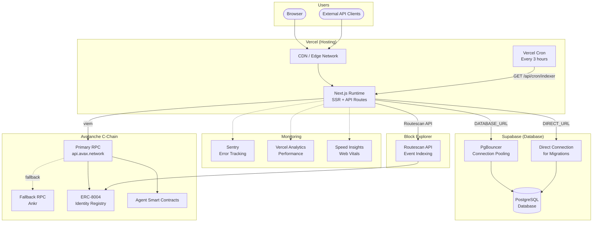
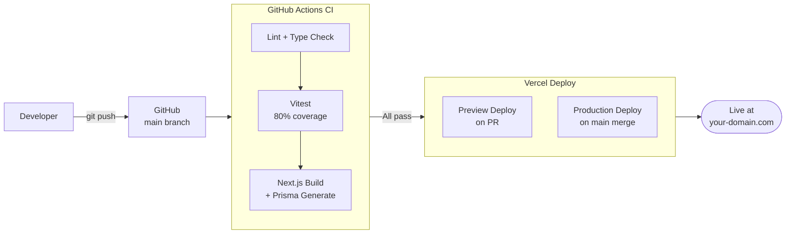
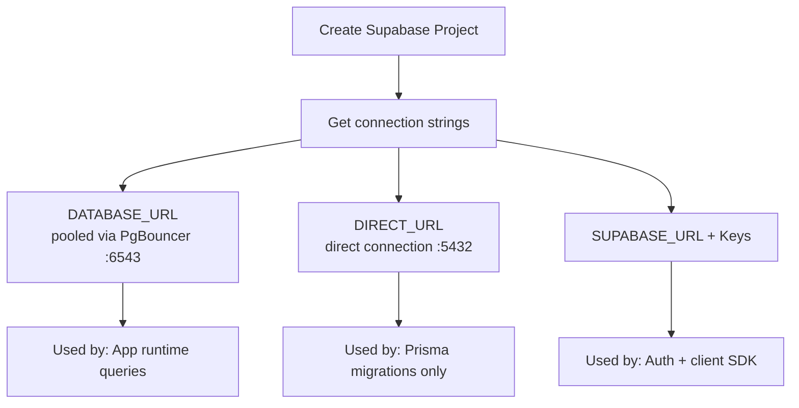
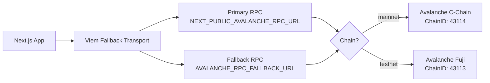
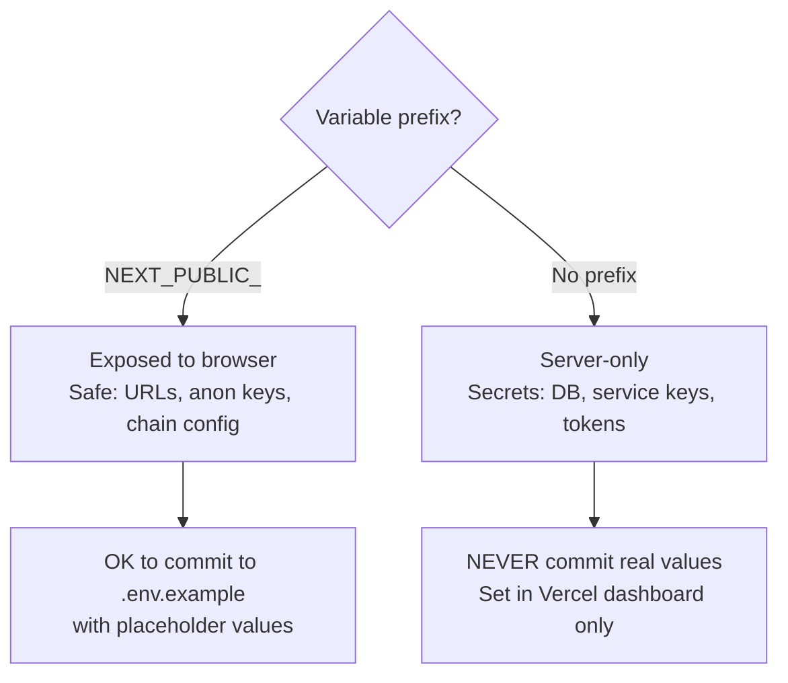
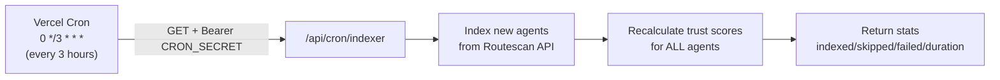
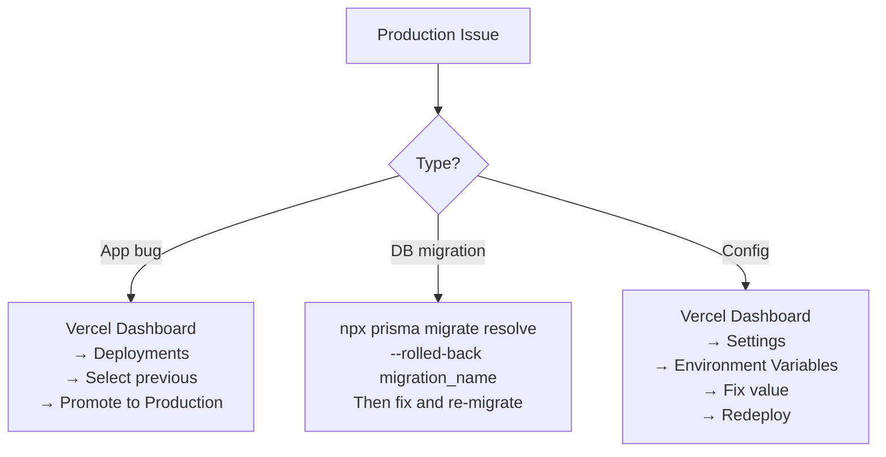

# Production Setup & Configuration Guide

## Infrastructure Overview



## Deployment Pipeline



## Step-by-Step Production Setup

### 1. Supabase Project



1. Go to [supabase.com](https://supabase.com) and create a new project
2. From **Settings > Database**, copy:
   - **Connection string (pooled)** → `DATABASE_URL`
   - **Connection string (direct)** → `DIRECT_URL`
3. From **Settings > API**, copy:
   - **Project URL** → `NEXT_PUBLIC_SUPABASE_URL`
   - **anon key** → `NEXT_PUBLIC_SUPABASE_ANON_KEY`
   - **service_role key** → `SUPABASE_SERVICE_ROLE_KEY`

4. Run migrations:
```bash
npx prisma migrate deploy
npx prisma generate
```

### 2. Vercel Project

1. Import project from GitHub at [vercel.com](https://vercel.com)
2. Set Framework Preset: **Next.js**
3. Set Build Command: `npm run build` (runs `prisma generate && next build`)
4. Add all environment variables (see section below)
5. Deploy

### 3. Avalanche RPC



**Options for RPC providers:**
- Public: `https://api.avax.network/ext/bc/C/rpc` (rate limited)
- Ankr: `https://rpc.ankr.com/avalanche` (free tier available)
- Infura, Alchemy, QuickNode (paid, higher limits)

### 4. WalletConnect

1. Go to [cloud.walletconnect.com](https://cloud.walletconnect.com)
2. Create a new project
3. Copy the **Project ID** → `NEXT_PUBLIC_WALLETCONNECT_PROJECT_ID`

### 5. Sentry

1. Create project at [sentry.io](https://sentry.io) (select Next.js)
2. Copy **DSN** → `SENTRY_DSN` and `NEXT_PUBLIC_SENTRY_DSN`
3. Create auth token → `SENTRY_AUTH_TOKEN`
4. Note org/project names → `SENTRY_ORG`, `SENTRY_PROJECT`

## Environment Variables

### Required

| Variable | Where | Description |
|----------|-------|-------------|
| `NEXT_PUBLIC_SUPABASE_URL` | Public | Supabase project URL |
| `NEXT_PUBLIC_SUPABASE_ANON_KEY` | Public | Supabase anon key (safe for client) |
| `SUPABASE_SERVICE_ROLE_KEY` | Server | Supabase admin key (never expose) |
| `DATABASE_URL` | Server | PostgreSQL via PgBouncer (pooled) |
| `DIRECT_URL` | Server | PostgreSQL direct (for migrations) |
| `NEXT_PUBLIC_CHAIN_ENV` | Public | `mainnet` or `testnet` |
| `NEXT_PUBLIC_AVALANCHE_RPC_URL` | Public | Primary Avalanche RPC URL |
| `NEXT_PUBLIC_WALLETCONNECT_PROJECT_ID` | Public | WalletConnect v2 project ID |
| `CRON_SECRET` | Server | Secret for Vercel Cron auth |
| `INDEXER_API_SECRET` | Server | Secret for manual indexer triggers |

### Optional

| Variable | Where | Description |
|----------|-------|-------------|
| `AVALANCHE_RPC_FALLBACK_URL` | Server | Fallback RPC (e.g., Ankr) |
| `NEXT_PUBLIC_SITE_URL` | Public | App URL for SEO/links |
| `SENTRY_DSN` | Server | Sentry DSN (server-side) |
| `NEXT_PUBLIC_SENTRY_DSN` | Public | Sentry DSN (client-side) |
| `SENTRY_ORG` | Build | Sentry organization |
| `SENTRY_PROJECT` | Build | Sentry project name |
| `SENTRY_AUTH_TOKEN` | Build | Sentry deploy auth token |

### Security Rules



- **NEVER** commit `.env.local` or `.env` with real values
- `NEXT_PUBLIC_*` variables are bundled into client JS — only put safe values
- `SUPABASE_SERVICE_ROLE_KEY` bypasses RLS — keep it server-side only
- Generate `CRON_SECRET` and `INDEXER_API_SECRET` with: `openssl rand -hex 32`

## Cron Jobs



**Configuration** (`vercel.json`):
```json
{
  "crons": [
    {
      "path": "/api/cron/indexer",
      "schedule": "0 */3 * * *"
    }
  ]
}
```

**Timeout**: 5 minutes max (Vercel Pro plan may be needed for long-running crons).

## Health Monitoring

### Health Check Endpoint

```
GET /api/v1/health
```

Returns:
```json
{
  "status": "healthy|degraded|unhealthy",
  "timestamp": "2026-02-25T14:00:00Z",
  "version": "0.1.0",
  "checks": {
    "database": { "status": "up", "latency_ms": 5 },
    "blockchain": { "status": "up", "latency_ms": 120 }
  }
}
```

| Status | Condition | HTTP |
|--------|-----------|------|
| `healthy` | Both DB and RPC up | 200 |
| `degraded` | One service down | 200 |
| `unhealthy` | Both services down | 503 |

### Monitoring Stack

```mermaid
flowchart TD
    subgraph Errors["Error Tracking"]
        Sentry[Sentry]
        SentryClient[Client errors<br/>10% replay sample]
        SentryServer[Server errors<br/>10% trace sample]
        SentryReplay[100% replay on error]
    end

    subgraph Performance["Performance"]
        VA[Vercel Analytics<br/>Page views, visitors]
        SI[Speed Insights<br/>Core Web Vitals]
    end

    subgraph Logs["Logging"]
        Pino[Pino Logger]
        PinoDev[Development:<br/>debug level, pretty-print]
        PinoProd[Production:<br/>info level, JSON format]
    end

    subgraph Custom["Custom Metrics"]
        Health[/api/v1/health<br/>DB + RPC latency]
        Visitor[/api/v1/visitors/stats<br/>Unique + total visits]
        DailyMetric[DailyMetric table<br/>Agents, scans, ratings]
    end
```

## Rate Limiting

| Endpoint | Limit | Window |
|----------|-------|--------|
| General API | 100 requests | 1 minute per IP |
| Registration | 5 requests | 1 hour per IP |
| Ratings | 20 submissions | 24 hours per wallet |
| Rating updates | 1 update | 1 hour cooldown per agent+wallet |
| Reports | 1 report | Per user per agent (permanent) |

Skipped endpoints: `/api/v1/health`, `/api/health`

## Rollback Procedure



## Security Checklist

- [ ] All `NEXT_PUBLIC_*` variables contain only safe/public values
- [ ] `SUPABASE_SERVICE_ROLE_KEY` set only in Vercel (never in client code)
- [ ] `CRON_SECRET` and `INDEXER_API_SECRET` generated with `openssl rand -hex 32`
- [ ] Rate limiting middleware active on all API routes
- [ ] Security headers configured (nosniff, DENY framing, XSS protection)
- [ ] Sentry configured and receiving errors
- [ ] Health endpoint responding correctly
- [ ] Vercel Cron running on schedule
- [ ] Database migrations applied cleanly
- [ ] No secrets in git history
