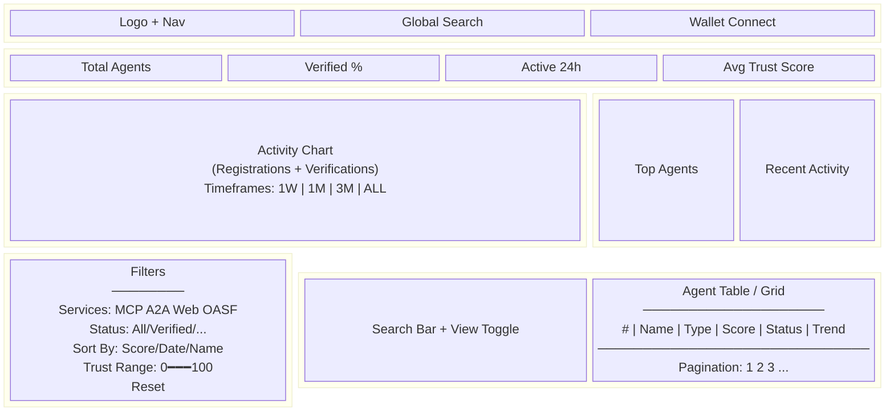

# Scanner / Directory

## Overview

The Scanner is the main discovery interface for browsing all registered agents on the platform. It provides both table and grid views with filtering, sorting, search, and sparkline visualizations.

## User Flow

```mermaid
flowchart TD
    Load[User loads /scanner] --> Fetch[useAgents hook fetches<br/>GET /api/v1/agents]
    Fetch --> Stats[useAgentStats fetches<br/>KPI card data]
    Fetch --> Render[Render agent table/grid]

    Render --> Filter{User applies<br/>filter?}
    Filter -->|Service chips| Refetch[Refetch with<br/>service=MCP|A2A|web|OASF]
    Filter -->|Status| Refetch
    Filter -->|Trust range| Refetch
    Filter -->|Sort| Refetch
    Refetch --> Render

    Render --> Search{User searches?}
    Search -->|Debounce 300ms| Autocomplete[Show autocomplete<br/>dropdown]
    Autocomplete -->|Select| Navigate[Navigate to<br/>/agents/address]
    Autocomplete -->|Enter| Refetch

    Render --> Click{User clicks<br/>agent row?}
    Click --> Navigate

    Render --> Page{Pagination?}
    Page --> Refetch

    Render --> Sparklines[useAgentSparklines<br/>batch fetch for visible agents]
```

## Page Layout



## Features

### Views

| View | Description |
|------|-------------|
| **Table** (default) | Columns: Rank, Name, Service Tags, Trust Score, Status, Updated, Sparkline, Share |
| **Grid** | 2/3/4-column card layout with avatar, score badge, sparkline, metadata icon |

### Filters

| Filter | Options | Default |
|--------|---------|---------|
| Service | MCP, A2A, Web, OASF (multi-select chips) | None |
| Status | All, Verified, Pending, Flagged, Suspended | All |
| Sort By | Trust Score, Date Added, Name | Trust Score |
| Sort Order | High to Low, Low to High | High to Low |
| Trust Score Range | Dual-thumb slider 0-100 (step 5) | 0-100 |

### Search

- Search by agent name or address (case-insensitive)
- Debounced input (300ms)
- Autocomplete dropdown with keyboard navigation (arrow keys, enter, escape)
- Max 100 characters

### Sparklines

- Batch fetched via `GET /api/v1/agents/sparklines?addresses=0x...,0x...`
- Shows last 10 trust score snapshots per agent
- Max 50 agents per request

## UI Components

| Component | File | Purpose |
|-----------|------|---------|
| `AgentTable` | `scanner/agent-table.tsx` | TanStack Table with sortable columns |
| `AgentCard` | `scanner/agent-card.tsx` | Grid card with sparkline |
| `Filters` | `scanner/filters.tsx` | Service chips, status, sort, trust range |
| `SearchBar` | `scanner/search-bar.tsx` | Debounced search with autocomplete |
| `KpiCard` | `scanner/kpi-card.tsx` | Stat card with trend sparkline |
| `ActivityChart` | `scanner/activity-chart.tsx` | Recharts area + bar chart |
| `AgentTableSkeleton` | `scanner/agent-table-skeleton.tsx` | Loading placeholder |
| `EmptyState` | `scanner/empty-state.tsx` | No results illustration |
| `ErrorState` | `scanner/error-state.tsx` | Error with retry button |

## States

| State | Behavior |
|-------|----------|
| **Loading** | Skeleton rows with shimmer animation |
| **Empty** | Illustration + "No agents found" + CTA |
| **Error** | Error icon + message + Retry button |
| **Data** | Table/grid with pagination |
