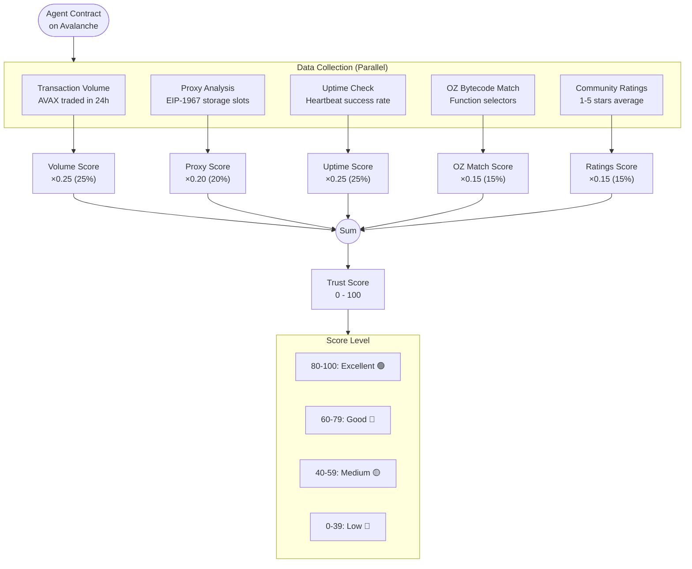
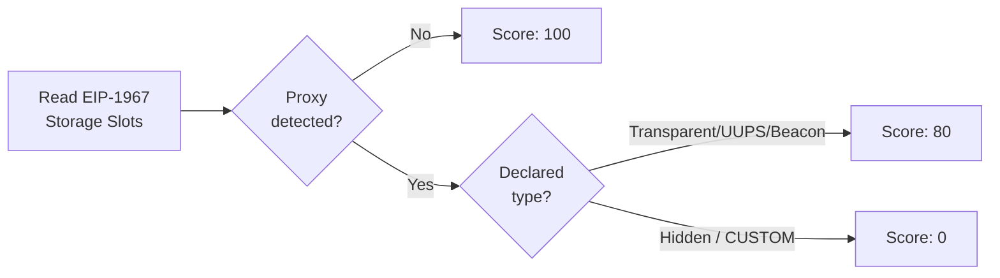

# Trust Score System

## Overview

The Trust Score is a composite rating (0-100) that measures the trustworthiness of an autonomous agent based on multiple verifiable signals.

## Calculation Flow



## Formula

```typescript
const WEIGHTS = {
  VOLUME:   0.25,  // 25% - Transaction volume activity
  PROXY:    0.20,  // 20% - Proxy transparency
  UPTIME:   0.25,  // 25% - Heartbeat response rate
  OZ_MATCH: 0.15,  // 15% - OpenZeppelin bytecode similarity
  RATINGS:  0.15,  // 15% - Community ratings average
};

trust_score = (volume_score * 0.25) +
              (proxy_score  * 0.20) +
              (uptime_score * 0.25) +
              (oz_score     * 0.15) +
              (ratings_score * 0.15)
```

## Score Components

### 1. Volume Score (25%)

Measures transaction activity through the agent's billing address.

| Volume (24h) | Score |
|--------------|-------|
| > 1000 AVAX  | 100   |
| 500-1000     | 80    |
| 100-500      | 60    |
| 10-100       | 40    |
| < 10 AVAX    | 20    |

### 2. Proxy Score (20%)

Penalizes agents with hidden or undeclared proxy contracts.



| Condition | Score |
|-----------|-------|
| No proxy detected | 100 |
| Declared proxy (TRANSPARENT, UUPS, BEACON) | 80 |
| Hidden proxy (CUSTOM / undeclared) | 0 |

### 3. Uptime Score (25%)

Based on heartbeat response rate over the last 24 hours.

```
uptime_pct = (successful_heartbeats / total_heartbeats) * 100
```

| Uptime % | Score |
|----------|-------|
| 99%+     | 100   |
| 95-99%   | 90    |
| 90-95%   | 70    |
| 80-90%   | 50    |
| < 80%    | 25    |

### 4. OpenZeppelin Match Score (15%)

Measures bytecode similarity to known secure OpenZeppelin contracts by detecting function selectors (PUSH4 opcode) and event topics.

**Detected components**: Ownable, Ownable2Step, AccessControl, Pausable, ReentrancyGuard, ERC20, ERC721, ERC1155

| Match Level | Score |
|-------------|-------|
| High (>80%) | 100   |
| Medium (50-80%) | 70 |
| Low (20-50%) | 40   |
| None (<20%) | 20    |

### 5. Community Ratings Score (15%)

Average of user ratings (1-5 stars), converted to 0-100 scale.

```
ratings_score = (average_rating / 5) * 100
// No ratings → default 50
```

## Score Ranges

| Range | Label | Color | Badge Variant | Interpretation |
|-------|-------|-------|---------------|----------------|
| 80-100 | Excellent | `#4ADE80` (Green) | `success` | Highly trusted, all signals positive |
| 60-79 | Good | `#22D3EE` (Cyan) | `info` | Generally trusted, minor concerns |
| 40-59 | Medium | `#FCD34D` (Yellow) | `warning` | Use with caution, some flags |
| 0-39 | Low | `#FB7185` (Red) | `destructive` | Not recommended, significant issues |

## Update Frequency

| Component | Trigger | Frequency |
|-----------|---------|-----------|
| Volume | Cron job | Every 3 hours |
| Proxy | On registration + cron | Every 3 hours |
| Uptime | Heartbeat pings | Continuous |
| OZ Match | On registration + cron | Every 3 hours |
| Ratings | User submission | Real-time |

## Default Scores (New Agents)

| Component | Default | Reason |
|-----------|---------|--------|
| Volume | 20 | No transaction history |
| Proxy | 100 | Not detected (assumed clean) |
| Uptime | 0 | No heartbeats recorded |
| OZ Match | 20 | No scan performed yet |
| Ratings | 50 | No community feedback |

**Typical initial trust score**: ~36-50

## API Response

```json
GET /api/v1/agents/{address}/trust-score

{
  "data": {
    "address": "0x123...",
    "score": 75,
    "breakdown": {
      "volume":  { "score": 80,  "weight": 0.25, "weighted": 20.0 },
      "proxy":   { "score": 100, "weight": 0.20, "weighted": 20.0 },
      "uptime":  { "score": 85,  "weight": 0.25, "weighted": 21.25 },
      "ozMatch": { "score": 70,  "weight": 0.15, "weighted": 10.5 },
      "ratings": { "score": 75,  "weight": 0.15, "weighted": 11.25 }
    },
    "lastUpdated": "2026-02-25T14:00:00Z"
  }
}
```
